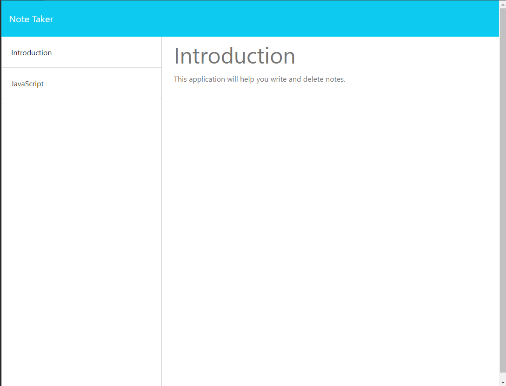

# Note-Taker-Pedro-Guerra

## Description

In this bootcamp challenge, the main goal is to build a code that will display a note-taking space. Once a user opens the app, the app will allow the user to add or delete notes. There was a starter code provided with all of the html and css done. Therefore, all of the work was done in javascript for this activity.

## Installation

N/A

## Usage

This challenged allowed me to improve my JavaScript skills, especially regarding express and routes. The biggest issue I ran into was getting the right path of the routes. Now, the app allows users to create & delete notes.

<a href="">Deployed Heroku Website Link</a>

## Credits

GA Tech bootcamp

## License

MIT License